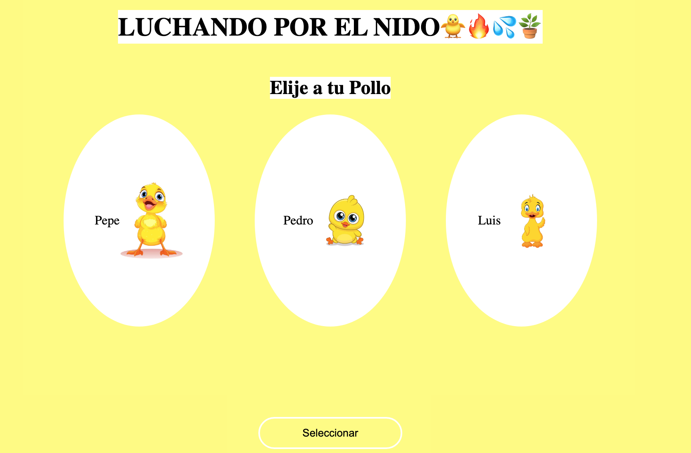

# 🎮 Mokepon – Juego de batalla elemental

## 🖼️ Vista previa




## 📌 Descripción
**Mokepon** es un juego web interactivo donde el jugador elige una mascota y se enfrenta a enemigos en un mapa.  
Cada mascota tiene ataques elementales (🔥 fuego, 💦 agua, 🪴 tierra), y el jugador debe seleccionar una secuencia de ataques para vencer a su oponente.

Este proyecto fue una prueba temprana para explorar lógica de juego, interacción con formularios, manejo de eventos y renderizado en canvas.

## ⚡ Funcionalidades
- 🐣 Selección de mascota entre tres personajes: Pepe, Pedro y Luis.
- 🧠 Sistema de ataques por turnos con elementos.
- 🗺️ Mapa interactivo con movimiento y renderizado en canvas.
- 🧾 Registro de ataques y combate contra enemigo.
- 🧼 Código modular y legible para facilitar mantenimiento.

## 🛠️ Tecnologías utilizadas
- HTML, CSS y JavaScript
- Canvas API para renderizar el mapa
- Fetch API para comunicación con servidor
- Backend local en `http://localhost:8080`

## ⚙️ Instalación y uso
1. Clona el repositorio:  
   ```bash
   git clone https://github.com/karina-ruiz/mokepon.git
   ```

2. Abre el archivo `index.html` en tu navegador.

3. Asegúrate de tener el servidor backend corriendo en `http://localhost:8080`.

4. Juega seleccionando tu mascota, eligiendo ataques y enfrentándote al enemigo.

## 👩‍💻 Autor
**Karina Guadalupe Ruiz Marcial**  
📌 GitHub: [@karina-ruiz](https://github.com/karina-ruiz)

## 🚀 Mejoras futuras
- Animaciones de combate y movimiento.
- Mejora en la lógica de IA enemiga.
- Integración con base de datos para guardar partidas.
- Versión multijugador en línea.
